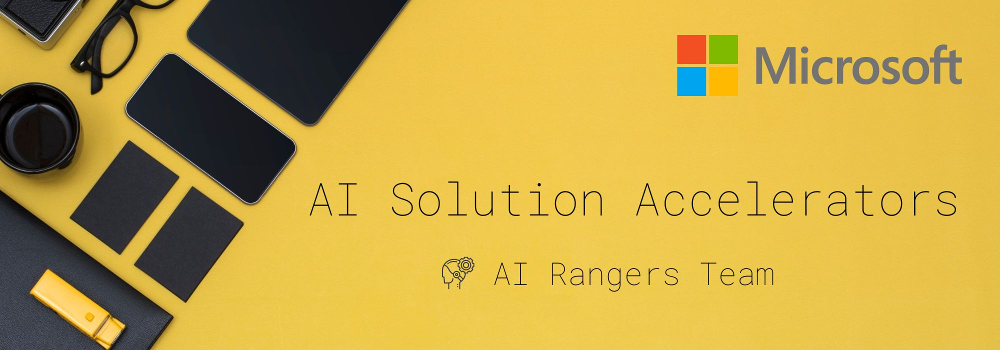

 
 

# AI Solution Accelerators

Developed by the Microsoft AI Rangers Team, the AI Solution Accelerators are repeatable IP meant to provide developers with all the resources needed to quickly build an initial solution. The objective is to jump-start the development efforts and to learn the used technologies in as little time as possible. The AI Solution Accelerators should be considered as templates that are fully customizable to the user's unique business case. 

These accelerators can be deployed on the Azure platform. Visit the official [Azure AI webpage](https://azure.microsoft.com/en-us/overview/ai-platform/) to learn more about Azure AI solution offerings.

 
 

## Summary Table of AI Solution Accelerators
Below is a summary list of the AI Solution Accelerators:
 
 

| Name      | Description | Services      | Link |
| ----------- | ----------- | ----------- | ----------- |
| Many Models Solution Accelerator      | For Machine Learning scenarios where having individual models performs better than a single larger model, and you need to train and maintain hundreds or thousands of models. | Azure Machine Learning | [Link](https://github.com/microsoft/solution-accelerator-many-models)
| Data and Model Drift Detection | Ready to use solution to detect both data drift and model drift in Machine Learning/Data Science scenarios.   | Azure Machine Learning | [Link](https://github.com/Azure/data-model-drift)
| Knowledge Mining Solution Accelerator | All of the resources neeed to quickly build an initial Knowledge Mining solution with Azure Cognitive Search and Cognitive Services | Cognitive Search, Speech, Language, Translator, Computer Vision | [Link](https://docs.microsoft.com/en-us/samples/azure-samples/azure-search-knowledge-mining/azure-search-knowledge-mining/)
| Business Process Automation | Creates pipelines to analyze text and audio datasets, across multiple cognitive services, and the HuggingFace library. The accelerator deploys all of the resources, and transforms the input data at each step, allowing multiple Cognitive Services to be called and deployed within a single, end-to-end pipeline. | Form Recognizer, Language, Speech, Computer Vision, AML, Blob storage, CosmosDB | [Link](https://github.com/Azure/business-process-automation)
| Social Media Analytics | Social Media monitoring platform that helps collect data from social media sites and websites and evaluate that data to make business decisions. | Text Analytics, Translator, CosmosDB, Synapse, Power BI | [Link](https://github.com/microsoft/Azure-Social-Media-Analytics-Solution-Accelerator)
| Medical Imaging | ML-based medical imaging asset using Azure that covers medical imaging use cases based on classification, object detection and instance segmentation. |AML including AutoML for Images | [Link](https://github.com/Azure/medical-imaging)
| Retail Recommender | Creates an end-to-end solution for large retailers with an e-commerce channel to provide personalized product recommendations to users based on their purchase history, product selection in the e-commerce channel, and their activity in the physical store. | Cosmos DB, Synapse, ADLS, AML, AKS, PBI | [Link](https://github.com/microsoft/Azure-Synapse-Retail-Recommender-Solution-Accelerator)
| MLOps v2 | MLOps v2 will allow AI professionals and our customers to deploy an end-to-end standardized and unified Machine Learning lifecycle scalable across multi workspaces. By abstracting agnostic infrastructure in an outer loop, the customer can focus on the inner loop development of their use cases. | Azure Machine Learning | [Link](https://microsoft.sharepoint.com/teams/CS_AzureDataAI/SitePages/Mlops.aspx)

 
 

## Use Cases behind the AI Solution Accelerators in More Details

We provide more details below for each AI solution accelerator and its intended use:
  

- [Many Models Solution Accelerator ](https://github.com/microsoft/solution-accelerator-many-models): In the real world, many problems can be too complex to be solved by a single machine learning model. Azure Machine Learning (AML) makes it easy to train, operate, and manage hundreds or even thousands of models. This repo will walk you through the end to end process of creating a many models solution from training to scoring to monitoring.
  
- [Data and Model Drift Detection](https://github.com/Azure/data-model-drift): The environment of our world is constantly changing. For machine learning, this means that deployed models are confronted with unknown data and can become outdated over time. A proactive drift management approach is required to ensure that productive AI services deliver consistent business value in the long term. This accelerator will help create automated pipelines to identify data drift regularly as part of an MLOps architecture.
  
- [Knowledge Mining Solution Accelerator](https://docs.microsoft.com/en-us/samples/azure-samples/azure-search-knowledge-mining/azure-search-knowledge-mining/): This accelerator provides all of the artifacts needed to quickly create a Cognitive Search Solution that includes templates for deploying the appropriate Azure resources, assets for creating the first search index, templates for using custom skills, a basic web app, and PowerBI reports to monitor search solution performance. Best practices were infused throughout the documentation to help guide the user. With Cognitive Search, the user can easily index both digital data (such as documents and text files) and analog data (such as images and scanned documents).
  
- [Business Process Automation](https://github.com/Azure/business-process-automation): This accelerator provides a no code Studio for users to quickly build complex, multi-stage AI pipelines across multiple Azure AI and ML Services. Users can select, and stack, AI/ML Services from across Azure Cognitive Services (Speech, Language, Form Recognizer, ReadAPI), Azure Machine Learning, and even Hugging Face state-of-the-art models, into a single, fully integrated pipeline. Integration between services is automated by BPA, and once deployed, a web app is created. This customizable UI* provides and drag-n-drop interface for end users to build multi service pipelines. Finally, the user-created pipeline is triggered as soon as the first input file(s) are uploaded, storing the results in a CosmosDB.
  
- [Social Media Analytics](https://github.com/microsoft/Azure-Social-Media-Analytics-Solution-Accelerator): The Social Media Accelerator provides the skeleton for building a Social Media monitoring platform that helps collect data from social media sites and websites and evaluate that data to make business decisions. This accelerator provides all the necessary resources to deploy the solution, as well as ideas and scenarios for extending the solution.
  
- [Medical Imaging](https://github.com/Azure/medical-imaging): The purpose of this accelerator is to demonstrate how Azure Machine Learning can be used to support medical imaging and other use cases in areas like data and model management, deployment, experiment tracking and explainability. Furthermore, we cover various data science approaches ranging from manual model development with PyTorch to automated machine learning for images. Another focus is to provide MLOPS based examples for automating the machine learning lifecycle for medical use cases including retraining when new data becomes available. All use cases are based on publicly available datasets like brain RMI scans, cell micrographs, chest x-ray images and more. Since we cannot distribute the data directly, we refer to publicly available download locations.
  
- [Retail Recommender](https://github.com/microsoft/Azure-Synapse-Retail-Recommender-Solution-Accelerator): This accelerator was built to provide developers with all of the resources needed to quickly build an Retail Recommender Solution based on Azure.
  
- [MLOps v2](https://microsoft.sharepoint.com/teams/CS_AzureDataAI/SitePages/Mlops.aspx): This accelerator will allow AI professionals and our customers to deploy an end-to-end standardized and unified Machine Learning lifecycle scalable across multi workspaces. By abstracting agnostic infrastructure in an outer loop, the customer can focus on the inner loop development of their use cases.
  
 

   

